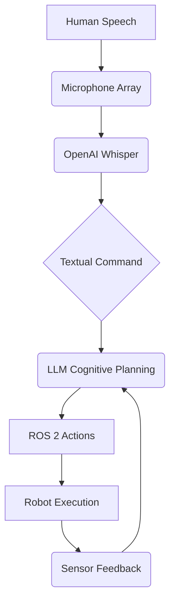

# Vision-Language-Action (VLA): Bridging Perception, Language, and Robotics

The true promise of embodied intelligence lies in the ability of robots to understand natural language, perceive their environment, and act purposefully within it. Vision-Language-Action (VLA) models represent a significant leap towards this goal, enabling robots to process multimodal inputs (vision, speech) and translate high-level commands into low-level robotic actions.

## The Convergence: LLMs and Robotics

Traditional robotics often relies on meticulously programmed sequences of actions. However, VLA aims to imbue robots with cognitive capabilities similar to humans, allowing them to:
-   **Understand complex, ambiguous commands**: "Clean the room" is far more abstract than "move arm to joint angle X."
-   **Adapt to novel situations**: Use contextual understanding to infer appropriate actions.
-   **Learn from human interaction**: Improve performance based on natural language feedback.

This convergence is primarily driven by the advancements in Large Language Models (LLMs). LLMs, originally designed for text processing, are now being leveraged to provide robots with a "cognitive planning" layer, translating human intent into executable robotic policies.

## OpenAI Whisper: Voice-to-Action

**OpenAI Whisper** is a general-purpose speech recognition model that excels in accuracy and robustness across various languages and noisy environments. It forms the crucial first step in a voice-driven VLA system: converting spoken commands into text.

### How Whisper Integrates:

1.  **Audio Input**: The robot's microphone array (e.g., ReSpeaker USB Mic Array from the Edge Kit) captures human speech.
2.  **Speech-to-Text Conversion**: The audio data is fed to a Whisper model (which can run on edge devices like the Jetson Orin Nano or in the cloud). Whisper transcribes the speech into text.
3.  **Textual Command**: This transcribed text becomes the input for the cognitive planning module.

## LLM Cognitive Planning: From Intent to Action

Once a natural language command is transcribed, a Large Language Model steps in for **cognitive planning**. The LLM's role is to bridge the semantic gap between human-level instructions and the robot's action space.

### The Planning Process:

1.  **Semantic Understanding**: The LLM interprets the meaning of the natural language command, understanding the objects, actions, and goals involved.
2.  **Task Decomposition**: Complex commands are broken down into a sequence of simpler, executable sub-tasks. For example, "Clean the room" might become: "Go to table," "Pick up cup," "Move cup to sink," "Return to table," "Pick up plate," etc.
3.  **Action Generation**: For each sub-task, the LLM generates a corresponding sequence of ROS 2 actions (e.g., navigation goals, manipulation commands, perception queries). This might involve:
    -   **ROS 2 Actions**: Publishing messages to `/cmd_vel` for movement, invoking a service to trigger a gripper, or calling an action client for complex manipulation.
    -   **Perception Queries**: Using vision models to locate objects.
4.  **Feedback Loop**: The robot executes the generated actions, and sensor feedback is provided back to the LLM (or a connected reasoning module) to monitor progress and adjust the plan if necessary.

## Speech-to-Action: The Full Pipeline

The complete VLA pipeline for "Speech-to-Action" combines these components:

## Data Privacy Considerations for VLA Deployment

VLA systems, by their nature, involve processing sensitive data, particularly voice input and potentially personal information embedded in natural language commands. Addressing data privacy is paramount.

-   **Voice Input**:
    -   **Local Processing**: Prioritize running speech-to-text models (like Whisper) directly on the edge device (e.g., Jetson Orin Nano) to minimize data transmission.
    -   **Anonymization**: If cloud-based services are used, ensure voice data is anonymized, stripped of PII, and encrypted during transit.
    -   **Consent**: Obtain explicit user consent for voice recording and processing.
-   **LLM Interactions**:
    -   **PII Filtering**: Implement robust filtering to prevent Personally Identifiable Information (PII) from being sent to external LLMs.
    -   **Local/Self-Hosted LLMs**: For highly sensitive applications, consider using smaller, specialized LLMs that can be run locally on the edge device or self-hosted servers.
    -   **Data Retention Policies**: Clearly define and implement policies for how long command history and related data are stored.
-   **Security**:
    -   **Access Control**: Ensure strong authentication and authorization mechanisms for accessing the robot and its VLA capabilities.
    -   **Secure Communication**: All communication channels (e.g., between edge device and cloud LLM) must be encrypted.
    -   **Emergency Stops**: Implement robust and easily accessible emergency stop mechanisms to prevent unintended or malicious actions.

By carefully designing the VLA pipeline with privacy and security in mind, we can build powerful, intuitive, and trustworthy robotic systems.